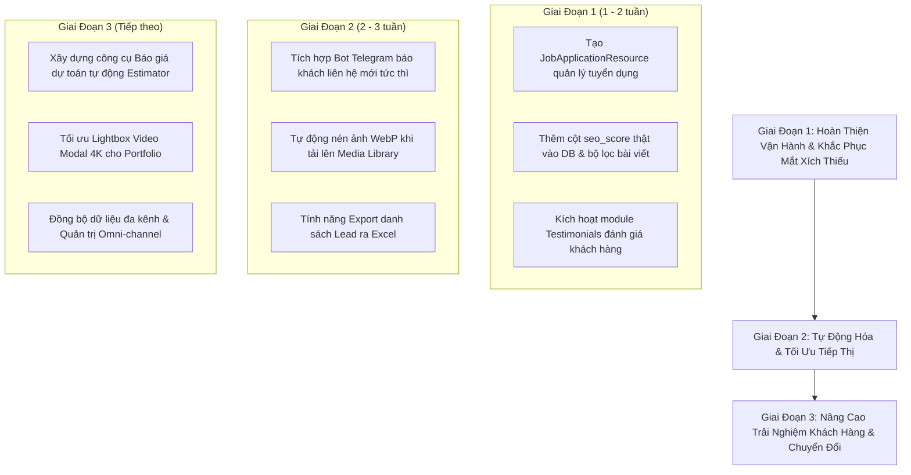

# TÀI LIỆU TỔNG QUAN HỆ THỐNG & ĐÁNH GIÁ CHỨC NĂNG
## CÔNG TY TRUYỀN THÔNG CỬU LONG (CLM MEDIA & TECH)

---

> **Phiên bản tài liệu:** 1.0  
> **Ngày lập:** Tháng 09/2026  
> **Nền tảng phát triển:** Laravel 11.x, Filament PHP v3.2, Livewire 3, Alpine.js, Tailwind CSS  
> **Mục tiêu hệ thống:** Hệ sinh thái số tích hợp giữa Cổng thông tin doanh nghiệp (Corporate Web Portal), Trưng bày hồ sơ năng lực (Portfolio & Case Studies), Phễu thu thập khách hàng tiềm năng (Lead Generation) và Hệ thống quản trị nội dung chuyên sâu (Headless/Integrated Enterprise CMS).

---

## MỤC LỤC
1. [Tổng Quan Dự Án & Kiến Trúc Công Nghệ](#1-tổng-quan-dự-án--kiến-trúc-công-nghệ)
2. [Hệ Thống Giao Diện & Tính Năng Phía Người Dùng (Frontend)](#2-hệ-thống-giao-diện--tính-năng-phía-người-dùng-frontend)
3. [Hệ Thống Quản Trị Chuyên Sâu (Filament Admin Panel)](#3-hệ-thống-quản-trị-chuyên-sâu-filament-admin-panel)
4. [Cơ Sở Dữ Liệu & Các Mô Hình Dữ Liệu Cốt Lõi (Database & Models)](#4-cơ-sở-dữ-liệu--các-mô-hình-dữ-liệu-cốt-lõi-database--models)
5. [Đánh Giá Khoảng Trống Nghiệp Vụ & Gợi Ý Chức Năng Cần Nâng Cấp](#5-đánh-giá-khoảng-trống-nghiệp-vụ--gợi-ý-chức-năng-cần-nâng-cấp)
6. [Lộ Trình Triển Khai Khuyến Nghị (Actionable Roadmap)](#6-lộ-trình-triển-khai-khuyến-nghị-actionable-roadmap)

---

## 1. TỔNG QUAN DỰ ÁN & KIẾN TRÚC CÔNG NGHỆ

### 1.1. Bối cảnh & Mục tiêu
Dự án được xây dựng nhằm thay thế toàn diện hệ thống WordPress cũ của **Truyền Thông Cửu Long** — một đơn vị sáng tạo và công nghệ hàng đầu tại Cần Thơ và khu vực Đồng bằng Sông Cửu Long (ĐBSCL). Hệ sinh thái tập trung vào 3 trụ cột giá trị cốt lõi:
1. **Truyền thông & Sáng tạo (Studio/Media):** Sản xuất Video TVC 4K, Phim doanh nghiệp, Phim phóng sự, Dịch vụ Livestream chuyên nghiệp.
2. **Công nghệ & Phần mềm (Tech):** Thiết kế Website hiệu năng cao, Web Application, Phần mềm quản lý, Mini App và Chuyển đổi số.
3. **Quảng cáo & Marketing Số (Agency/Marketing):** Chiến lược SEO tổng thể, Booking báo chí/KOLs, Quản trị thương hiệu số và Performance Ads.

### 1.2. Kiến trúc & Công nghệ cốt lõi
* **Backend Framework:** Laravel 11.31 (PHP ^8.2).
* **Quản trị CMS:** Filament v3.2 (Tận dụng sức mạnh Livewire 3 + Alpine.js).
* **Phân quyền & Bảo mật:**
  * `spatie/laravel-permission` + `bezhansalleh/filament-shield`: Phân quyền RBAC (Role-Based Access Control) chi tiết đến từng Resource và Action.
  * `stephenjude/filament-two-factor-authentication`: Xác thực 2 bước (2FA) bảo vệ tài khoản quản trị.
  * `spatie/laravel-activitylog`: Ghi vết mọi thao tác CRUD dữ liệu của ban quản trị (Audit Trail).
* **Trình biên tập nội dung & Quản lý Media:**
  * `amidesfahani/filament-tinyeditor`: Soạn thảo trực quan chuẩn SEO hỗ trợ giao diện tiếng Việt.
  * `unisharp/laravel-filemanager` & `App\Livewire\Admin\MediaLibraryPicker`: Thư viện ảnh tùy biến tích hợp sâu vào bộ gõ bài viết.
* **Cấu trúc cây đa cấp:** `solution-forest/filament-tree` hỗ trợ kéo thả thứ tự chuyên mục và cấu trúc điều hướng Menu.
* **Tối ưu hóa UI/UX & Phong cách thiết kế:**
  * Hệ màu nhận diện thương hiệu: Amber (`#f59e0b`), Deep Orange (`#ea580c`), Navy Base (`#0B132B` / `#070F1E`).
  * Tuân thủ tiêu chuẩn tương phản **WCAG AA** cho chữ viết trên nền sáng.
  * Typography: Bộ 3 font chữ hiện đại Google Fonts (`Space Grotesk`, `Plus Jakarta Sans`, `JetBrains Mono`).
  * Hiệu ứng chuyển động mượt mà với GSAP (ScrollTrigger, Flip animation, Smooth Anchor scrolling).

---

## 2. HỆ THỐNG GIAO DIỆN & TÍNH NĂNG PHÍA NGƯỜI DÙNG (FRONTEND)

Toàn bộ hệ thống giao diện công khai được xây dựng responsive 100%, tích hợp cấu trúc vi dữ liệu SEO Schema.org (`Organization`, `Article`, `Service`).

### 2.1. Trang Chủ (`/`)
* **Preloader Thương Hiệu:** Hiệu ứng tải trang thương hiệu dưới 700ms với thanh tiến trình gradient chỉ hiển thị ở trang chủ nhằm không gây ức chế cho người dùng khi lướt các trang con.
* **Hero Section Cinematic:** Banner mở đầu ấn tượng kết hợp hiệu ứng timeline trình chiếu định vị kép "Creative Production Studio & Enterprise Tech Agency". Nút CTA kép dẫn thẳng đến trang Báo giá và Dự án.
* **Marquee Logo Đối Tác & Khách Hàng:** Dải logo chuyển động vô tận (Infinite Marquee) tự động đồng bộ từ cơ sở dữ liệu (cache 24 giờ), chứng minh uy tín và năng lực thực thi.
* **Quy Trình 2 Ngành — 1 Chuẩn Mực:** Khối trình bày quy trình sản xuất Media và quy trình phát triển Công nghệ theo tiêu chuẩn đồng nhất.
* **Công Nghệ & Thiết Bị Thực Chiến:** Bảng thông số chi tiết các thiết bị ghi hình chuẩn điện ảnh (Sony FX series, Blackmagic, Ronin, hệ thống dựng 8K) và Tech Stack lập trình hiện đại.
* **Ba Trụ Cột Năng Lực (Core Pillars):** Thiết kế thẻ dịch vụ nổi khối (3D Card Hover) tương tác trực tiếp tới các phân nhánh dịch vụ chính.
* **Số Liệu Thống Kê (GSAP Counter):** Tự động đếm số dự án hoàn thành, năm kinh nghiệm, tỷ lệ hài lòng khi cuộn màn hình tới vị trí tương ứng.
* **Khối Spotlight "Tại sao chọn CLM":** Điểm khác biệt khi doanh nghiệp có cả đội ngũ sản xuất media hình ảnh lẫn lập trình viên công nghệ trong cùng một tổ chức.
* **Portfolio Đa Tầng (Tab-trong-tab):** Trình diễn linh hoạt giữa các Case Studies dự án thực tế và Kho 39 mẫu giao diện website phân loại tự động theo 14 ngành kinh doanh.
* **Kinh Nghiệm & Góc Nhìn Chuyên Gia (Insights):** Trích xuất các bài viết chất lượng cao về SEO, công nghệ, truyền thông.
* **CTA Chân Trang (Flowing Gradient):** Dải kêu gọi hành động nổi bật thúc đẩy liên hệ tư vấn.

### 2.2. Nhóm Dịch Vụ (`/dich-vu`)
* **Trang Tổng Quan Dịch Vụ (`/dich-vu`):** Hub điều hướng phân loại chi tiết năng lực của Cửu Long Media.
* **Trang Thiết Kế Website & Ứng Dụng (`/dich-vu/web-app`):** 
  * Chi tiết quy trình UI/UX, lập trình, hạ tầng Cloud và bàn giao mã nguồn.
  * Tích hợp 4 dự án phần mềm tiêu biểu và 4 mẫu giao diện chọn lọc từ cơ sở dữ liệu.
* **Trang Sản Xuất Video & TVC (`/dich-vu/media`):** Trưng bày dịch vụ quay TVC, phim quảng cáo, video ngắn TikTok/Reels và phóng sự cưới/sự kiện.
* **Trang Digital Marketing & SEO (`/dich-vu/marketing`):** Giải pháp tối ưu từ khóa Top Google, chạy quảng cáo đa kênh và định vị thương hiệu.
* **Trang Booking Truyền Thông (`/dich-vu/booking`):** Mạng lưới kết nối người nổi tiếng, KOLs, KOCs và các đầu báo lớn uy tín.
* **Trang Chi Tiết Dịch Vụ Động (`/dich-vu/{slug}`):** Tự động điều hướng 301 thông minh các slug cũ sang route chuẩn mới hoặc hiển thị nội dung dịch vụ chi tiết kèm danh sách dịch vụ liên quan.

### 2.3. Kho Mẫu Giao Diện Website Demo (`/dich-vu/kho-giao-dien`)
* Trưng bày các mẫu thiết kế website mẫu chuẩn hóa cho doanh nghiệp.
* **Bộ lọc 14 ngành nghề:** Bất động sản, Nhà hàng - Khách sạn, Thú cưng, Thời trang, Giáo dục, Y tế - Thẩm mỹ, Du lịch, Công nghệ, Doanh nghiệp...
* Tích hợp thanh tìm kiếm tức thời theo từ khóa và phân trang chuẩn hóa SEO.

### 2.4. Bảng Giá Dịch Vụ Minh Bạch (`/dich-vu/bang-gia`)
* Trình bày bảng giá phân tầng (Tier pricing) theo 3 tab chuyên biệt: **Sản Xuất Video & TVC**, **Thiết Kế Web & App**, **Quảng Cáo & Marketing Số**.
* Nổi bật gói khuyên dùng (Featured Badge) với viền gradient và nút CTA kích thích chuyển đổi trực tiếp.
* Dữ liệu bảng giá được quản trị 100% từ CMS và lưu bộ nhớ đệm (Cache) 24h nhằm đạt tốc độ tải tức thì.

### 2.5. Hệ Thống Dự Án & Case Studies (`/du-an`, `/du-an/{slug}`)
* **Danh sách dự án:** Lọc theo lĩnh vực (Media / Tech) kèm phân trang mượt mà.
* **Trang chi tiết Case Study:**
  * Đo lường hiệu quả bằng **KPI thực tế** (Ví dụ: +250% Traffic, 1.2M Lượt tiếp cận, X3 Doanh thu).
  * Video Trailer Player (Tự động nhận diện ID YouTube và trích xuất thumbnail phân giải cao 4K không làm chậm website).
  * Thư viện ảnh quy trình (Project Gallery) và bài học kinh nghiệm sau triển khai.

### 2.6. Blog Tin Tức & Kiến Thức Thực Chiến (`/bai-viet`, `/{slug}`)
* **Cơ chế định tuyến Catch-all:** Route `/{slug}` đặt ở cuối hệ thống, tự động phân giải URL xem đó là Chuyên mục hay Bài viết đơn lẻ, bảo toàn 100% URL thân thiện kế thừa từ WordPress.
* **Lọc theo Pillar:** Hỗ trợ phân loại bài viết theo 5 nhóm trụ cột: `tech`, `studio`, `agency`, `resource`, `corporate`.
* **Tìm kiếm AJAX tức thời (`/api/search-posts`):** Gợi ý kết quả tìm kiếm kèm ảnh đại diện ngay khi người dùng gõ từ 2 ký tự.
* **Mục Lục Tự Động Thông Minh (Auto Table of Contents - TOC):** Parser tự động quét các thẻ `<h2>`, `<h3>` trong nội dung để tạo mục lục neo liên kết mượt mà.
* **Bộ định dạng bài viết Listicle chuyên nghiệp (`ArticleEditorialFormatter`):** Tự động nhận diện bài viết dạng danh sách (Top mẫu, Top địa chỉ, Top lý do...) để render hộp thông tin chuyên nghiệp (Highlight box, Badges, Callout).
* **Tính năng Xem Trước Bản Nháp (Draft Preview):** Biên tập viên có thể tạo link bảo mật có chữ ký mã hóa (`signedRoute: post.preview`) để gửi duyệt bài viết trước khi xuất bản ra công chúng.

### 2.7. Trung Tâm Tải Tài Nguyên Miễn Phí (`/tai-nguyen`)
* Chuyên trang chia sẻ Ebook, biểu mẫu, tài liệu hướng dẫn chuyển đổi số và marketing.
* **Phễu Thu Thập Khách Hàng (Lead-Magnet Mechanism):** Người dùng cần điền Họ tên, Số điện thoại, Email để mở khóa tài liệu. Dữ liệu này được tự động lưu vào hàng chờ chăm sóc khách hàng của Admin.

### 2.8. Hệ Trang Doanh Nghiệp & Tuyển Dụng
* **Về Chúng Tôi (`/ve-chung-toi`):** Tuyên ngôn sứ mệnh, tầm nhìn, văn hóa doanh nghiệp và bộ nhận diện Cửu Long Media.
* **Mạng Lưới Đối Tác (`/doi-tac`):** Phân hạng đối tác theo 3 cấp bậc rõ ràng (Top Tier, Gold Tier, Strategic) có cache hỗ trợ tải siêu nhanh.
* **Khách Hàng Tiêu Biểu (`/khach-hang`):** Danh sách khách hàng kèm bộ lọc nhóm ngành công nghiệp.
* **Tuyển Dụng Nhân Tài (`/tuyen-dung`):**
  * Hiển thị các vị trí việc làm đang mở.
  * Form nộp hồ sơ trực tuyến: Cho phép ứng viên upload CV file đính kèm (`.pdf`, `.doc`, `.docx`, tối đa 10MB) lưu trữ an toàn trong thư mục riêng tư (`private/cv`).
* **Hồ Sơ Năng Lực Số (`/ho-so-nang-luc`):** Interactive Digital Profile cho phép đối tác xem trực tiếp hồ sơ năng lực mà không cần tải file nặng.
* **Chính Sách & Điều Khoản (`/chinh-sach-bao-mat`, `/dieu-khoan-dich-vu`):** Đảm bảo chuẩn mực pháp lý cho website doanh nghiệp.

### 2.9. Trang Liên Hệ & Tiện Ích Toàn Cục (Global UX)
* **Trang Liên Hệ (`/lien-he`):** Form gửi thông tin có áp dụng bộ giới hạn tốc độ (Rate Limiting `throttle:5,1`) ngăn chặn spam bot, tích hợp bản đồ nhúng Google Maps động từ cài đặt chung.
* **Thanh Điều Hướng Đa Cấp Động (Dynamic Menu):** Header & Mobile Drawer tự động đọc từ CSDL (bảng `menus` & `menu_items`), có thể cấu hình màu sắc, icon, badge "Hot/New" linh hoạt mà không cần can thiệp code.
* **Floating Quick-Action Buttons:** Cụm nút liên hệ cố định góc màn hình (Zalo chat trực tiếp, nút Gọi điện có vòng sóng xung kích động).
* **Sitemap Chuẩn SEO (`/sitemap.xml`):** Tự động sinh XML sitemap cho toàn bộ bài viết, chuyên mục, dự án, dịch vụ và các trang tĩnh.

---

## 3. HỆ THỐNG QUẢN TRỊ CHUYÊN SÂU (FILAMENT ADMIN PANEL)

* **Đường dẫn truy cập:** `/cuulongteam` (Đã ẩn và thay thế đường dẫn `/admin` mặc định nhằm tăng cường bảo mật trước các cuộc dò quét tự động).
* **Brand Name:** *Truyền Thông Cửu Long* với tông màu cam Amber chủ đạo.

### 3.1. Trang Đăng Nhập Tuỳ Biến (`CustomLogin`)
* Thiết kế Dark Mode sang trọng, biểu tượng khóa bảo vệ thương hiệu.
* Nút ẩn/hiện mật khẩu hợp nhất thông minh (1 icon đa năng cho cả 2 trạng thái).
* Bắt lỗi form tiếng Việt 100%, hiệu ứng trượt cảnh báo lỗi (Error Slide In) và hiệu ứng đổi viền input tương tác cao.

### 3.2. Dashboard & Các Widget Thông Minh
1. **DashboardOverview:** Đo lường tổng quan các chỉ số bài viết, dự án, liên hệ.
2. **NewContactsWidget:** Danh sách yêu cầu tư vấn mới nhất cần phản hồi ngay.
3. **NewJobApplicationsWidget:** Bảng theo dõi các hồ sơ xin việc ứng tuyển mới nhất kèm trạng thái duyệt.
4. **SeoHealthWidget:** Phân tích điểm sức khỏe SEO tổng thể toàn website.
5. **MediaStatsWidget:** Báo cáo dung lượng ổ đĩa đã dùng và thống kê file ảnh, video.
6. **QuickActionsWidget:** Các lối tắt tạo nhanh bài viết, thêm dự án, xóa cache hệ thống.

### 3.3. Các Nhóm Quản Trị Dữ Liệu (Resources)

#### Nhóm "Nội Dung"
* **Bài viết (`PostResource`):**
  * Soạn thảo TinyMCE tiếng Việt, chọn ảnh từ Thư viện Media nội bộ.
  * Tích hợp công cụ chấm điểm SEO tức thì (**SEO Score Calculator**) phân tích 7 tiêu chí: Độ dài tiêu đề, Meta Description, Thẻ Canonical, Từ khóa chính trong tiêu đề/mô tả/URL, Mật độ từ khóa trong nội dung và Ảnh đại diện.
  * Phân loại theo Trụ cột năng lực (Pillar Group), Trạng thái Bản nháp / Xuất bản, Ngày hẹn giờ đăng.
  * Nút Xem trước (Preview) bảo mật bằng chữ ký số.
* **Tài nguyên tải về (`ResourcePostResource`):** Chuyên trách quản lý các tài liệu phục vụ phễu lead magnet ở trang `/tai-nguyen`.
* **Chuyên mục (`CategoryResource`):** Quản lý cấu trúc chuyên mục bài viết, phân nhóm Pillar, gắn cờ chuyên mục lọc giao diện ngành nghề (`is_industry_filter`).

#### Nhóm "Kinh Doanh"
* **Dự án tiêu biểu (`CaseStudyResource`):**
  * Quản lý thông tin dự án, khách hàng, năm thực hiện, danh mục.
  * Trường nhập chỉ số KPI thực tế đo lường thành công.
  * Nhúng link Video YouTube (tự động bóc tách thumbnail 4K) và tải lên bộ sưu tập ảnh thực tế (Gallery).
* **Bảng giá dịch vụ (`PricingPlanResource`):**
  * Quản lý gói giá theo 3 phân nhánh: TVC, Web, Marketing.
  * Nhập danh sách tính năng quyền lợi dạng Tag trực quan.
  * Cơ chế tự động bỏ chọn nổi bật các gói khác khi kích hoạt 1 gói thành Nổi bật (Featured) trong cùng nhóm.
* **Yêu cầu liên hệ (`ContactResource`):**
  * Hiển thị Badge đếm số lượng tin nhắn mới chưa đọc ngay trên thanh menu.
  * Xem chi tiết nội dung khách nhắn, dịch vụ quan tâm, địa chỉ IP gửi yêu cầu.
  * Cung cấp ô ghi chú nội bộ (`admin_note`) để đội ngũ kinh doanh lưu tiến độ chăm sóc và nút ghi nhận thời gian phản hồi (`replied_at`).

#### Nhóm "Quản Lý Website"
* **Mạng lưới Đối tác (`PartnerResource`):** Quản lý logo, link website, phân hạng 3 cấp độ (Top Tier, Gold Tier, Strategic) kèm tính năng giới hạn số lượng hiển thị trên trang chủ để tránh vỡ giao diện.
* **Khách hàng tiêu biểu (`ClientResource`):** Quản lý hồ sơ đối tác khách hàng theo nhóm ngành công nghiệp và năm hợp tác.
* **Menu & Điều hướng (`MenuResource` & `MenuItemResource`):** 
  * Quản lý vị trí Menu Header/Footer.
  * Kéo thả sắp xếp thứ tự đa cấp cha - con bằng cây thư mục (`filament-tree`).
  * Tùy chỉnh icon Tailwind, màu chữ, nhãn badge và màu nền cho từng liên kết.

#### Nhóm "Nội Dung Chung" & "Cấu Hình SEO"
* **Cài đặt website (`GeneralSettings`):** Quản lý tập trung Hotline, Email, các liên kết mạng xã hội (Facebook, Zalo, YouTube), thông tin địa chỉ và URL nhúng Google Maps.
* **Thư viện Media (`MediaLibrary`):** Quản lý tập trung toàn bộ hình ảnh tải lên hệ thống theo dạng lưới (Grid), hỗ trợ tìm kiếm theo tên, xem dung lượng và xóa đồng loạt.
* **Chuyển hướng 301 (`RedirectResource`):**
  * Bộ công cụ bảo toàn thứ hạng SEO khi chuyển đổi từ WordPress sang Laravel.
  * Tự động phát hiện và đánh dấu đỏ cảnh báo các URL bị trùng lặp.
  * Bộ đếm số lượt người dùng truy cập link cũ (`hits`) và nút "Test" mở nhanh kiểm tra đích đến.

#### Nhóm "Hệ Thống & Phân Quyền"
* **Quản lý người dùng (`UserResource`):** Thêm mới tài khoản, đổi mật khẩu, kích hoạt/vô hiệu hóa thành viên ban biên tập.
* **Phân quyền vai trò (Shield / Roles & Permissions):** Trao quyền linh hoạt theo vai trò (Super Admin, Biên tập viên, Chăm sóc khách hàng) đến từng thao tác Tạo, Sửa, Xem, Xóa.
* **Bảo mật 2FA:** Quản lý cấu hình xác thực 2 lớp cho từng tài khoản quản trị.

---

## 4. CƠ SỞ DỮ LIỆU & CÁC MÔ HÌNH DỮ LIỆU CỐT LÕI (DATABASE & MODELS)

Hệ thống sở hữu 15 Model chính tương ứng với cấu trúc cơ sở dữ liệu hoàn chỉnh:

| Tên Model | Bảng CSDL | Chức Năng Chính & Quan Hệ |
| :--- | :--- | :--- |
| `User` | `users` | Tài khoản quản trị & biên tập viên; Tích hợp 2FA, Spatie Permissions. |
| `Post` | `posts` | Quản lý bài viết blog & tài nguyên; Thuộc về `Category`, `User` (tác giả); Tính điểm SEO runtime. |
| `Category` | `categories` | Chuyên mục đa cấp (ModelTree); Quan hệ 1-Nhiều với `Post`. |
| `CaseStudy` | `case_studies` | Hồ sơ dự án năng lực; Lưu trữ mảng KPI metrics, video YouTube và gallery ảnh. |
| `Service` | `services` | Danh mục dịch vụ cốt lõi kèm danh sách tính năng (JSON features). |
| `PricingPlan` | `pricing_plans` | Các gói giá dịch vụ; Hỗ trợ lưu danh sách quyền lợi (JSON features) và gắn cờ nổi bật. |
| `Partner` | `partners` | Danh sách đối tác; Quản lý phân tầng theo section hiển thị (JSON display_sections). |
| `Client` | `clients` | Khách hàng doanh nghiệp phân theo ngành nghề (`IndustryCategory`). |
| `Contact` | `contacts` | Lưu trữ toàn bộ dữ liệu form liên hệ và lead tải tài nguyên từ người dùng. |
| `JobApplication` | `job_applications` | Hồ sơ ứng tuyển tuyển dụng kèm đường dẫn file CV lưu trong ổ đĩa riêng tư. |
| `Menu` | `menus` | Vị trí menu trên website (Header, Footer); Quan hệ 1-Nhiều với `MenuItem`. |
| `MenuItem` | `menu_items` | Từng liên kết đơn lẻ trong menu, hỗ trợ phân cấp đệ quy cha-con (Tree structure). |
| `MediaFile` | `media_files` | Quản lý tập tin hình ảnh/tài liệu được tải lên hệ thống. |
| `Redirect` | `redirects` | Bản ghi chuyển hướng URL cũ (WordPress) sang URL mới (Laravel) mã 301/302. |
| `Setting` | `settings` | Cấu hình website dạng Key-Value (Hotline, Email, Map, Social links) có Cache. |

---

## 5. ĐÁNH GIÁ KHOẢNG TRỐNG NGHIỆP VỤ & GỢI Ý CHỨC NĂNG CẦN NÂNG CẤP

Dù hệ sinh thái hiện tại đã rất đồ sộ và hoàn thiện cao, qua khảo sát toàn diện mã nguồn, có một số mắt xích nghiệp vụ còn khuyết thiếu hoặc có thể nâng cấp để đưa hệ thống lên tầm xuất sắc:

### 5.1. Nhóm Nghiệp Vụ Quản Trị Tuyển Dụng (Thiếu Resource Quản Lý)
* **Thực trạng:** 
  * Website đã có trang nộp CV (`/tuyen-dung`), model `JobApplication` và Widget `NewJobApplicationsWidget` ngoài Dashboard.
  * **Tuy nhiên:** Trong thư mục `app/Filament/Resources` hoàn toàn **chưa có `JobApplicationResource`**. Quản trị viên chỉ có thể thấy 5 hồ sơ mới nhất ngoài Dashboard nhưng không có nơi để bấm vào xem toàn bộ hồ sơ, xem thư giới thiệu (Cover letter), tải file CV về máy, hay chuyển đổi trạng thái ứng viên (Chờ duyệt -> Đã liên hệ -> Đạt -> Không đạt).
* **Đề xuất giải pháp:**
  * Tạo ngay `JobApplicationResource` trong nhóm menu "Kinh Doanh" hoặc "Nhân Sự".
  * Thêm nút hành động Tải file CV an toàn (Download Action) và cập nhật nhanh trạng thái ứng viên.
  * Tách module "Tin tuyển dụng" thành một Model độc lập thay vì phải mượn bảng `Post` lọc theo danh mục như hiện tại, giúp quản lý rõ ràng mức lương, hạn nộp hồ sơ, địa điểm làm việc.

### 5.2. Nhóm Thông Báo Tự Động & Chăm Sóc Khách Hàng (Notification & CRM)
* **Thực trạng:** Khi người dùng gửi form liên hệ hoặc nộp hồ sơ ứng tuyển, hệ thống mới chỉ lưu vào CSDL. Ban giám đốc hoặc nhân viên kinh doanh phải chủ động vào trang admin mới biết có khách mới.
* **Đề xuất giải pháp:**
  * **Tích hợp Telegram Bot hoặc Zalo ZNS / Mail Admin:** Mỗi khi có khách gửi yêu cầu tư vấn hoặc ứng viên nộp CV, hệ thống tự động bắn một thông báo tức thì (Push notification) về nhóm Telegram nội bộ của công ty.
  * **Auto-responder Email cho khách hàng:** Gửi email cảm ơn tự động đính kèm tài liệu Company Profile (PDF) chuyên nghiệp ngay sau khi khách điền thông tin.
  * **Xuất dữ liệu (Export Lead):** Bổ sung nút Export danh sách liên hệ (`Contact`) ra file Excel/CSV phục vụ chiến dịch Telesale và Remarketing.

### 5.3. Nhóm Tối Ưu Quản Trị Bài Viết & Điểm SEO
* **Thực trạng:** 
  * Cột `seo_score` hiện tại là Accessor tính toán on-the-fly khi duyệt Model. Vì không có cột thật trong database nên trong bảng danh sách bài viết **không thể sắp xếp (sortable) hay lọc (filterable)** theo bài viết có điểm SEO từ cao xuống thấp để ưu tiên biên tập.
* **Đề xuất giải pháp:**
  * Thêm cột `seo_score` (integer) vào bảng `posts`. Sử dụng Model Observer (`saving`) để tự động tính điểm và lưu giá trị vào database mỗi khi lưu bài.
  * Bổ sung bộ lọc trong `PostResource`: "Bài viết cần tối ưu SEO" (Điểm < 60 điểm) để đội ngũ content nhanh chóng rà soát và bổ sung từ khóa, thẻ meta.
  * Bổ sung tính năng **Tự Động Nén Ảnh WebP**: Tự động chuyển đổi và nén tối ưu dung lượng ảnh tải lên qua Media Library nhằm tăng tốc độ tải trang lên mức tối đa.

### 5.4. Nhóm Công Cụ Trợ Lực Chuyển Đổi Trên Website (Conversion Rate Optimization - CRO)
* **Bộ Tính Chi Phí Dự Án Trực Tuyến (Project Cost Estimator):**
  * Cho phép khách hàng vào trang web tự click chọn các tiêu chí: Loại dịch vụ (Làm Web / Quay TVC / SEO), Quy mô dự án, Thời gian cần hoàn thành -> Hệ thống tự động tính ra khoảng giá dự kiến và cho phép khách nhấn "Nhận báo giá chi tiết qua Zalo/Email". Đây là tính năng tạo đột phá về tỷ lệ chuyển đổi khách hàng tiềm năng.
* **Popup Video Modal Trực Tiếp:**
  * Ở các trang Case Study và Dịch vụ, cho phép người dùng bấm xem video ngay trong một Lightbox Modal nổi bật độ phân giải 4K mà không cần chuyển hướng sang YouTube.
* **Widget Đánh Giá Khách Hàng (Testimonial / Review System):**
  * Dù đã có migration `create_testimonials_table` trong hệ thống nhưng chưa được đưa ra Resource quản trị và chưa gắn lên giao diện trang chủ. Nên đưa khối Đánh giá từ đối tác/khách hàng lên để gia tăng sự tin tưởng (Social Proof).

---

## 6. LỘ TRÌNH TRIỂN KHAI KHUYẾN NGHỊ (ACTIONABLE ROADMAP)

Để phát triển dự án theo định hướng bài bản và chuyên nghiệp nhất, lộ trình được chia làm 3 giai đoạn trọng tâm:

### Chi tiết các đầu việc ưu tiên cao nhất cần làm ngay:
1. **Xây dựng `JobApplicationResource`:** Cung cấp đầy đủ giao diện xem thông tin ứng viên, xem thư giới thiệu, nút bấm tải CV và cập nhật tiến độ tuyển dụng cho phòng nhân sự.
2. **Lưu trữ điểm SEO vào CSDL:** Tạo migration thêm cột `seo_score` cho bảng `posts`, giúp lọc nhanh các bài viết chất lượng thấp để tối ưu lại thứ hạng Google.
3. **Cấu hình thông báo Telegram tức thì:** Đảm bảo khi có bất kỳ khách hàng nào điền form tư vấn, đội ngũ tư vấn viên sẽ nhận được chuông thông báo ngay trong 5 giây để liên hệ chốt đơn kịp thời.

---
*Tài liệu được tổng hợp tự động dựa trên toàn bộ cấu trúc mã nguồn thực tế của dự án `truyenthongcuulong-laravel`.*
